# _PODSTAWY CSS (Notatki z podręczników i kursów)_

# Wprowadzenie do CSS

# Selektory

Łatwość przyporządkowania zbioru stylów wszystkim elementom tego samego typu jest jedną z podstawowych zalet CSS.
Edytując jeden wiersz kodu CSS, można zmienić kolor wszystkich nagłówków.

Pozwala to projektantowi strony skupić się na projektowaniu zamiast na bardziej przyziemnej pracy.

Oczywiście, CSS nie rozwiąże wszystkich naszych problemów — <u>na przykład nie można go użyć do zmiany przestrzeni
kolorów w rysunkach</u> — ale może uczynić wykonywanie globalnych zmian o wiele prostszym

## Podstawowe reguły tworzenia stylów

Przed HTML5, aby wszystkie h2 były wyświetlane w szarym kolorze, należało dla każdego h2 napisać:

```html
<h2><font color="gray">To jest nagłówek</font></h2>
```

A w HTML5 tak:

```html
<h2 style="color: gray">To jest nagłówek</h2>
```

CSS pozwala na tworzenie reguł, które łatwo jest zmieniać, edytować i stosować do wszystkich elementów tekstowych, jakie
się definiuje. Przykładowo, by wszystkie elementy h2 stały się szare, wystarczy zapisać poniższą regułę raz:

```css
h2 {
  color: gray;
}
```

### Selektory elementów

Selektor elementu odnosi się do elementu HTML np. takich jak `p, h3, em, a` czy nawet sam `html`. Przykładowo:

```css
html {
  color: black;
}

h1 {
  color: gray;
}

h2 {
  color: silver;
}
```

### Deklaracje oraz słowa kluczowe

Deklaracja składa się nazwy właściwości dwukropka, _wartości_ i jest zakończona średnikiem. Po dwukropku oraz średniku
może znajdować się zero albo dowolna liczba spacji. _Wartość_ jest albo pojedyńczym słowem kluczowym, albo oddzieloną
spacjami listą kilku słów kluczowych dozwolonych dla tej właściwości. Jeśli w deklaracji zostanie użyta niepoprawna
właściwość bądź jej wartość, cała deklaracja jest ignorowana.

Słowa kluczowe mogą być oddzielone także za pomocą ukośników (/) lub przecinków.

```css
p {
  font: medium Helvetica;
}

h2 {
  font: large/150% sans-serif;
}
```

Rozdzielane spacjami słowa nazywane są słowami kluczowymi i razem tworzą wartość danej właściwości. Ukośnik oddziela
słowa kluczowe ustawiające wielkość tekstu oraz wysokość wiersza.

Od jakiegoś czasu ukośnik zaczął się pojawiać w wartościach innych właściwości. Są to między innymi
(ta lista może ulec zmianie):

- background
- border-image
- border-radius
- grid
- grid-area
- grid-column
- grid-row
- grid-template
- mask-border

Przy deklarowaniu wielu wartości — na przykład parametrów kilku obrazów w tle, przejść oraz cieni — deklaracje są
rozdzielone właśnie przecinkami. Ponadto przecinki są stosowane do rozdzielania parametrów funkcji, takich jak gradienty
liniowe i przekształcenia. Oto przykład:

```css
.box {
  box-shadow: inset -1px -1px white, 3px 3px 3px rgba(0, 0, 0, 0.2);
  background-image: url(myimage.png), linear-gradient(180deg, #fff 0%, #000 100%);
  transform: translate(100px, 200px);
}

a:hover {
  transition: color, background-color 200ms ease-in 50ms;
}
```

## Grupowanie

### Grupowanie selektorów

Możemy grupować dowolną liczbę selektorów, rozdzielając je przecinkami. Poniżej dwóm elementom, określonym przez dwa
selektory przypisano styl:

```css
h2,
p {
  color: grey;
}
```

#### Selektor uniwersalny

_Selector uniwersalny_, którego symbolem jest zak gwiazdki (*) pasuje do każdego elementu, na zasadzie podobnej do
działania symboli wieloznacznych (ang. *wildcard\*).

```css
* {
  color: red;
}
```

Taka deklaracja jest równoważna ze zgrupowaną listą selektorów obejmującą każdy element zawarty w dokumencie. Selektor
uniwersalny pozwala na przypisanie wartości red właściwości color do każdego elementu dokumentu za jednym razem. Ma
specyficzność 0-0-0.

### Grupowanie deklaracji

W jednej regule grupujemy deklaracje:

```css
h1 {
  font: 18px Helvetica;
  color: purple;
  background: aqua;
}
```

Najlepiej jest zawsze stawiać średnik za ostatnią deklaracją, bez względu na miejsce użycia reguły.

### Grupowanie wszystkiego

Jeśli chcemy, aby każdy nagłówek otrzymał ten sam zestaw stylów to, piszemy:

```css
h1,
h2,
h3,
h4,
h5,
h6 {
  color: gray;
  background: white;
  padding: 0.5em;
  border: 1px solid black;
  font-family: Charcoal, sans-serif;
}
```

Zgrupowanie selektorów oznacza, że style z prawej strony reguły nadane zostaną wszystkim wymienionym typom nagłówków.
Zgrupowanie deklaracji oznacza natomiast, że wszystkie wymienione style zostaną przypisane do selektorów z lewej strony
reguły.

### Nowe elementy w starych przeglądarkach

Przeglądarki Internet Explorer starsze od wersji IE9 nie obsługują elementów, których nie znają. Rozwiązanie polega na
utworzeniu takiego elementu w drzewie DOM i poinformowaniu w ten sposób przeglądarki, iż element tego rodzaju istnieje.

```javascript
// np. dla elementu main
document.createElement('main');
// teraz można nadawać style dla elementu main w IE8
```

## Selektory klas oraz identyfikatorów

Oprócz selektorów elementów dokumentu istnieją jeszcze dwa inne ich rodzaje:

1. Selektory klas (ang. _class selectors_)
2. Selektory identyfikatorów (ang. _ID selectors_)

Pozwalają one na przypisanie stylów w sposób <u>niezależny od elementów dokumentu</u> i mogą zostać użyte samodzielnie
lub w połączeniu z selektorami elementów. Nazwą jednej klasy możemy oznaczyć różne elementy i nadać im jednolity styl.

### Selektory klas

Selektor klas składa się z kropki i wartości atrybutu `class` elementu, do którego chcemy się odwołać.

```css
.warning {
  color: red;
}
```

Selektor uniwersalny (jawnie zapisywany w postaci gwiazdki — \*) jest stosowany domyślnie, kiedy jakiś identyfikator,
klasę, selektor atrybutu, selektor pseudoklasy lub pseudoelementu zapisze się bez powiązania z selektorem elementu.

Gdy chcemy, aby tekst był czerwony tylko wtedy, gdy cały akapit jest ostrzeżeniem to, napiszemy:

```css
p.warning {
  font-weight: bold;
}
```

Ten selektor wybierze wszystkie elementy `p` z atrybutem class zawierającym słowo warning — ale pominie wszystkie inne
elementy, bez względu na to, czy zawierają one atrybut class, czy też nie.

### Wiele klas

Dzięki połączeniu dwóch selektorów klas można wybrać tylko te elementy, które zawierają obie nazwy klas, w dowolnej
kolejności.

```css
.warning {
  font-weight: bold;
}

.urgent {
  font-style: italic;
}

.warning.urgent {
  background: silver;
}
```

Każdy element, którego atrybut class zawiera nazwy dwóch klas `warning i urgent` napisanych w dowolnej kolejności,
będzie miał srebrne tło.

### Selektory identyfikatorów

Selektory identyfikatorów odnoszą się do wartości atrybutu id i poprzedzone są krzyżykiem (#), zwanym niekiedy „haszem”:

```css
*#first-para {
  font-style: italic;
}
```

Tak jak w przypadku selektorów klas, możliwe jest pominięcie selektora uniwersalnego. W poprzednim przykładzie równie
dobrze można by napisać:

```css
#first-para {
  font-style: italic;
}
```

### Wybór pomiędzy klasą a identyfikatorem

W rzeczywistości przeglądarki zazwyczaj nie sprawdzają niepowtarzalności identyfikatora w dokumencie HTML, co oznacza,
że jeśli wprowadzi się do dokumentu kilka elementów posiadających tę samą wartość identyfikatora, najprawdopodobniej
style zostaną zastosowane we wszystkich tych elementach. Nie jest to poprawne zachowanie, ale tak się zdarza. Obecność
więcej niż jednej takiej samej wartości id w dokumencie utrudnia również tworzenie skryptów DOM, gdyż funkcje takie jak
`getElementById()` bazują na fakcie istnienia jednego — i tylko jednego — elementu o danej wartości identyfikatora.

Identyfikator ma wyższy priorytet przy ustalaniu tego, który styl powinien zostać nadany elementowi.

HTML definiuje wartości klas i identyfikatorów jako wrażliwe na wielkość znaków, zastosowanie dużych liter w wartościach
klas i identyfikatorów powinno więc być zgodne w stylach i w dokumencie.

## Selektory atrybutów.

Na początku mała dygresja. Istnieją oprócz HTML-u inne języki znaczników takie jak XML, XHTML, SVG czy MAthML.

W przypadku selektorów klas, jak i identyfikatorów, wybiera się wartości atrybutów, jednakże w innych językach
znaczników takie selektory mogą nie istnieć.

W CSS2 wprowadzono selektory atrybutów, które mogą być wykorzystywane do wybierania elementów na podstawie ich atrybutów
i wartości tych atrybutów.

Istnieją cztery typy selektorów atrybutów:

1. Proste selektory atrybutów.
2. Dokładne selektory wartości atrybutów.
3. Selektory wartości atrybutów o dopasowaniu częściowym.
4. Selektory atrybutów bazujące na dopasowaniu początku ich wartości.

### Proste wybieranie atrybutów

Prosty selektor atrybutów pozwala wybrać elementy posiadające określony atrybut, bez względu na jego wartość.

```css
h1[class] {
  padding: 10px;
}
```

Powyższy selektor wybierze wszystkie nagłówki `h1` z atrybutem `class` o dowolnej wartości.

Dla celów diagnostycznych możemy stworzyć taki selektor:

```css
img[alt] {
  border: 1px solid red;
}
```

Pozwoli on nam określić, czy mamy poprawnie zdefiniowany znacznik `img`.

Inny przykład już niediagnostyczny to:

```css
*[title] {
  color: green;
}
```

Każdy element zawierający informację title, którą większość przeglądarek wyświetla jako wskazówki typu tool tip, kiedy
kursor znajdzie się nad danym elementem, będzie miał kolor zielony.

Można łączyć selektory atrybutów:

```css
a[class][title] {
  font-weight: bold;
}
```

### Wybieranie według dokładnej wartości atrybutu

Można zawęzić proces wyboru do tych elementów, których atrybuty mają pewną konkretną wartość.

```css
a[href="http://www.w3.org/"][title="W3C Home"]
{
  font-size: 200%;
}

p[class='urgent warning'] {
  font-weight: bold;
}
```

Drugi Selektor wybierze każdy element `p`, którego atrybut class ma wartość dokładnie `urgent warning` — słowa te muszą
być ułożone w takiej właśnie kolejności, z pojedynczą spacją pomiędzy nim. Innymi słowy, polega to na dokładnym
dopasowaniu łańcucha znaków.

Selektory identyfikatorów oraz selektory atrybutów, których celem jest atrybut id, nie są dokładnie tym samym. Różnica
pomiędzy `h1#page-title` oraz `h1[id="page-title"]` polega na innej specyficzności tych selektorów.

### Wybieranie oparte na częściowej wartości atrybutu

Tabela. Selektory atrybutów dopasowujące fragmenty łańcuchów znaków

| Typ          | Opis                                                                                                   |
| ------------ | ------------------------------------------------------------------------------------------------------ |
| [foo~="bar"] | Każdy element z atrybutem foo, którego wartość zawiera słowo bar na liście oddzielonych spacjami słów. |
| [foo*="bar"] | Każdy element z atrybutem foo, którego wartość zawiera łańcuch znaków bar.                             |
| [foo^="bar"] | Każdy element z atrybutem foo, którego wartość zaczyna się od bar.                                     |
| [foo$="bar"] | Każdy element z atrybutem foo, którego wartość kończy się na bar.                                      |

`[foo|="bar"]` Każdy element z atrybutem foo, którego wartość zaczyna się od łańcucha bar, po którym następuje znak
kreski (U+002D) lub którego wartość jest dokładnie równa bar

#### Dopasowywanie początku lub całego atrybutu

Rozważmy następującą regułę:

```css
*[lang|='en'] {
  color: white;
}
```

Reguła ta wybierze każdy element, którego atrybut lang jest równy en lub rozpoczyna się od en. W ten sposób pierwsze
trzy elementy następującego przykładu zostaną wybrane, natomiast dwa ostatnie nie:

```html
<h1 lang="en">Hello!</h1>
<p lang="en-us">Greetings!</p>
<div lang="en-au">G'day!</div>
<p lang="fr">Bonjour!</p>
<h4 lang="cy-en">Jrooana!</h4>
```

Ogólnie rzecz biorąc, forma `[att|="val"]` może być wykorzystywana z dowolnym atrybutem oraz dowolnymi wartościami.

```css
img[src|='rysunek'] {
  border: 1px solid gray;
}
```

Do tego selektora pasuje zbiór obrazów w HTML: rysunek-1.png, rysunek-2.png itp.

#### Dopasowywanie jednego słowa z listy słów oddzielonych spacjami (TODO)

<!-- TODO-->

#### Dopasowywanie fragmentu łańcucha znaków na początku wartości atrybutu (TODO)

<!-- TODO-->

#### Dopasowywanie fragmentu łańcucha znaków na końcu wartości atrybutu (TODO)

<!-- TODO-->

### Identyfikator braku wrażliwości na wielkość znaków (TODO)

<!-- TODO-->

## Wykorzystywanie struktury dokumentu

Ogromne możliwości CSS wynikają ze sposobu wykorzystywania struktury dokumentów HTML do ustalenia stylu, który powinien
zostać przypisany danemu elementowi.

### Omówienie relacji pomiędzy elementami rodzica i dziecka

Rozważmy poniższy, bardzo prosty dokument HTML:

```html
<html lang="">
  <head>
    <base href="https://www.meerkat.web/" />
    <title>Centrum mangust</title>
  </head>

  <body>
    <h1>Centrum <em>Mangust</em></h1>
    <p>
      Witamy w Centrum <em>Mangust</em>,
      <strong>
        najlepszej stronie o mangustach
        <a href="inet.html">w <em>całym</em> Internecie</a></strong
      >!
    </p>
    <ul>
      <li>
        Oferujemy:
        <ul>
          <li>
            <strong>Szczegółowe informacje</strong> o tym, jak zaadoptować
            mangustę
          </li>
          <li>Wskazówki, jak żyć z mangustą</li>
          <li>
            <em>Zabawy</em> z mangustami, w tym:

            <ol>
              <li>Bawienie się w aportowanie</li>
              <li>Kopanie w poszukiwaniu jedzenia</li>
              <li>Bawienie się w chowanego</li>
            </ol>
          </li>
        </ul>
      </li>
      <li>... i wiele więcej!</li>
    </ul>
    <p>
      Masz pytania?
      <a href="mailto:suricate@meerkat.web">Skontaktuj się z nami!</a>
    </p>
  </body>
</html>
```

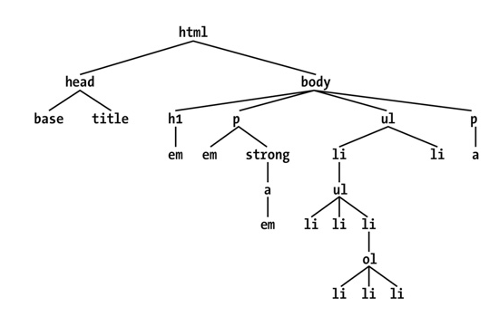

Rysunek. Struktura drzewa dokumentu.

W tej hierarchii każdy element ma swoje miejsce w ogólnej strukturze dokumentu i jest albo elementem rodzica, albo
elementem dziecka innego elementu (a często jednocześnie odgrywa obie te role).

Element jest rodzicem innego elementu, jeśli w hierarchii dokumentu znajduje się on bezpośrednio nad tym elementem. Na
przykład na rysunku pierwszy element `p` jest rodzicem elementów `em` oraz `strong`, natomiast element `strong` jest
rodzicem elementu `a`, będącego z kolei rodzicem innego elementu `em`.

Element jest dzieckiem innego elementu, jeśli znajduje się on bezpośrednio poniżej tego elementu. Dlatego element `a` na
rysunku jest dzieckiem elementu `strong`, który z kolei jest dzieckiem elementu `p` i tak dalej.

Pojęcia „rodzic” i „dziecko” są szczególnymi przypadkami terminów przodek oraz potomek. Jeśli element znajduje się
dokładnie jeden poziom ponad innym elementem, wtedy występuje <u>relacja rodzic-dziecko</u>. Jeśli jednak ścieżka od
jednego elementu do drugiego wiedzie poprzez dwa lub więcej poziomów, wtedy pomiędzy elementami występuje <u>relacja
przodek-potomek</u>, a nie rodzic-dziecko (oczywiście dziecko jest także potomkiem, a rodzic przodkiem).

Na rysunku pierwszy element `ul` jest rodzicem dwóch elementów `li`, natomiast pierwszy `ul` jest również przodkiem dla
każdego elementu wewnątrz swojego dziecka `li` (aż do najgłębiej zagnieżdżonych elementów `li`).

Na rysunku widać również element `a` będący dzieckiem elementu `strong`, ale równocześnie potomkiem elementu `p`, jak
również elementów `body` oraz `html`. Element `body` jest przodkiem wszystkich elementów, które domyślnie wyświetli
przeglądarka, natomiast element `html` jest przodkiem wszystkich elementów dokumentu. Z tego powodu w dokumentach HTML
lub XHTML element
`html` jest czasami nazywany elementem głównym (ang. _root element_).

### Selektory kontekstowe

Selektor kontekstowy (ang. contextual selectors), zwanych również selektorem potomnym (ang. descendant selector).

```css
h1 em {
  color: gray;
}
```

W selektorze kontekstowym lewa strona reguły składa się z dwóch lub większej liczby selektorów elementów rozdzielonych
spacjami. Spacja jet tu przykładem kombinatora (ang. _combinator_), który może być interpretowany jako: „znaleziony
wewnątrz” lub „będący potomkiem”. W ten sposób `h1 em`można przetłumaczyć jako „każdy element `em` będący potomkiem
elementu `h1`”.

```css
nav ul li a {
  color: black;
}
```

Powyższy selektor wybierze każdy odnośnik, który jest potomkiem `li`, który jest potomkiem `ul`, który z kolei jest
potomkiem elementu `nav`.

Bliskość dwóch elementów w drzewie dokumentu nie ma wpływu na to, czy reguła zostanie zastosowana, czy nie. Staje się to
ważne w kontekście specyficzności. Jeśli na przykład napisze się `ul em`, składnia ta wybierze każdy element `em` będący
potomkiem elementu `ul`, bez względu na głębokość zagnieżdżenia tego `em`.

### Wybieranie elementów dzieci

Możemy zawęzić wybór potomków do tych elementów, które są dziećmi innych elementów, korzystając ze składni ze znakiem
`>`

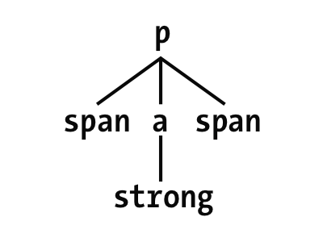

Przykładowo element `a` jest rodzicem elementu strong, jednak jest również dzieckiem elementu `p`. Elementy z tego
fragmentu mogłyby zostać wybrane dzięki selektorom `p > a` oraz `a > strong`, <u>jednak już nie `p > strong`, ponieważ
`strong` jest potomkiem elementu `p`, ale nie jego dzieckiem</u>. Możliwe jest również łączenie zależności między
potomkami `a` dziećmi w tym samym selektorze. Na przykład selektor `table.summary td > p` wybierze wszystkie
elementy `p` będące dziećmi elementu `td`, który z kolei jest potomkiem elementu `table` zawierającego atrybut `class`
wraz ze słowem `summary`.

```css
h1 > strong {
  color: red;
}
```

Powyższa reguła sprawi, że jedynie element strong znajdujący się w pierwszym z poniższych nagłówków h1 zostanie
wyświetlony na czerwono:

```html
<h1>To jest <strong>bardzo</strong> ważne.</h1>
<h1>
  To jest <em>naprawdę <strong>bardzo</strong></em> ważne.
</h1>
```

### Wybieranie przylegających elementów rodzeństwa

Element znajdujący się bezpośrednio po innym elemencie wewnątrz tego samego rodzica wybieramy, korzystając z kombinatora
— znaku plusa (+) (ang. _adjacent sibling combinator_).

```css
h1 + p {
  margin-top: 0;
}
```

Jeśli element `p` i `h1` mają wspólnego rodzica to zostanie wybrany każdy element `p` bezpośrednio występujący po
elemencie `h1`.

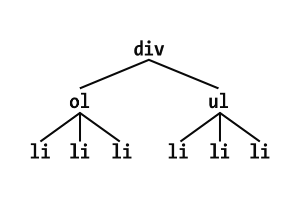

Za pomocą pojedynczego selektora ze znakiem `+` możliwe jest wybranie tylko drugiego z dwóch przylegających elementów
będących rodzeństwem. Dla `li + li {font-weight: bold;}` pogrubione zostaną tylko drugie i trzecie elementy obu list.

Aby te selektory tego typu działały poprawnie, CSS wymaga, by dwa elementy pojawiały się w kolejności zgodnej z
kolejnością, w jakiej napisano je w kodzie źródłowym.

Tekst znajdujący się pomiędzy dwoma elementami nie przeszkadza w działaniu selektora (kombinatora) sąsiadujących
elementów rodzeństwa.

```html
<div>
  <ol>
    <li>Element listy 1</li>
    <li>Element listy 1</li>
    <li>Element listy 1</li>
  </ol>
  To jest jakiś tekst będący częścią elementu 'div'.
  <ul>
    <li>Element listy</li>
    <li>Kolejny element listy</li>
    <li>I jeszcze jeden element listy</li>
  </ul>
</div>
```

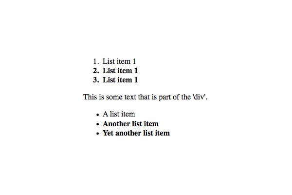

Choć pomiędzy dwiema listami pojawia się tekst, selektor `ol + ul` i tak wybierze drugą z list. Tekst ten nie jest
zawarty w żadnym elemencie rodzeństwa, a jest po prostu częścią wspólnego rodzica `div`. Gdyby opakowało się ten tekst w
element`p`, trzeba by wtedy napisać `ol + p + ul`.

Selektory przylegającego elementu rodzeństwa można wykorzystywać w połączeniu z innymi kombinatorami:

```css
html > body table + ul {
  margin-top: 1.5em;
}

div#content h1 + div ol {
  background-color: rebeccapurple;
}
```

### Wybieranie następnych elementów rodzeństwa

Kombinator ogólny elementów rodzeństwa (ang. general sibling combinator) reprezentowany przez znak tyldy (~), umożliwia
wybranie dowolnego elementu, który następuje po innym elemencie, jeśli oba te elementy mają tego samego rodzica.

```css
h2 ~ ol {
  font-style: italic;
}
```

```html
<div>
  <h2>Subheadings</h2>
  <p>
    It is the case that not every heading can be a main heading. Some headings
    must be subheadings. Examples include:
  </p>
  <ol>
    <li>Headings that are less important</li>
    <li>Headings that are subsidiary to more important headlines</li>
    <li>Headings that like to be dominated</li>
  </ol>
  <p>Let's restate that for the record:</p>
  <ol>
    <li>Headings that are less important</li>
    <li>Headings that are subsidiary to more important headlines</li>
    <li>Headings that like to be dominated</li>
  </ol>
</div>
```

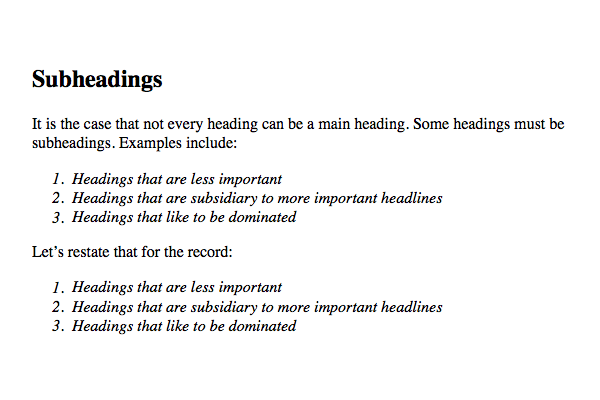

Kursywą zostały wyświetlone obie listy numerowane, gdyż obie następują po elemencie `h2` i mają z tym elementem
wspólnego rodzica (element `div`).

## Selektory pseudoklas

Selektory te umożliwiają przypisywanie stylów do tzw. klas fantomowych — klas wynikających ze stanu określonych
elementów, z pewnych wzorców strukturalnych w dokumencie albo nawet ze stanu samego dokumentu.

Według „Słownika Języka polskiego PWN”:

fantom

1. «zjawa»
2. «model anatomiczny przedstawiający jakiś narząd lub sylwetkę człowieka»
3. «odczuwanie bólu, swędzenia w miejscu po amputowanej kończynie lub jej części»

Zamiast klasy można też użyć selektora pseudoklasy do osiągnięcia tego samego efektu za pomocą podobnych rozwiązań.

### Łączenie pseudoklas

CSS umożliwia łączenie („łańcuchowanie”) pseudoklas.

```css
a:link:hover {
  color: red;
}

a:visited:hover {
  color: maroon;
}
```

Kolejność nie ma w tym przypadku znaczenia; można byłoby napisać `a:hover:link` i uzyskać taki sam efekt jak
przypadku `a:link:hover`.

Należy uważać, aby nie łączyć wzajemnie wykluczających się pseudoklas. Na przykład łącze nie może być jednocześnie
odwiedzone i nieodwiedzone, konstrukcja `a:link:visited` nie ma więc sensu.

### Pseudoklasy strukturalne

Większość pseudoklas jest strukturalna — odnoszą się one do struktury kodu dokumentu źródłowego.

Wszystkie pseudoklasy są zapisywane w postaci słów kluczowych poprzedzonych pojedynczym dwukropkiem (:) i mogą się
pojawić w dowolnym miejscu w obrębie selektora oraz zawsze odwołują się one do elementu, z którym są powiązane — i do
żadnego innego.

Eric A. Meyer:

> Otóż kiedy, w 2003 roku urodziło się moje pierwsze dziecko, ogłosiłem tę wieść w internecie (jak każdy…). Kilka
> osób złożyło mi gratulacje i odpowiedziało żarcikami związanymi z CSS, których najlepszym przykładem był selektor
> `#ericmeyer:first-child`. Problem polega na tym, że taki selektor wybrałby mnie, a nie moją córkę,
> i to tylko wtedy, gdybym był pierwszym dzieckiem moich rodziców (tak się składa, że istotnie jestem). Aby prawidłowo
> wskazać moje pierwsze dziecko, selektor powinien mieć postać `#ericmeyer > :first-child`.

Należy zapamiętać, że efekt działania pseudoklas polega na przypisaniu czegoś w rodzaju „klasy fantomowej” do elementu,
do którego się one odwołują.

#### Wybieranie elementu głównego

Pseudoklasa `:root` wybiera element główny dokumentu. W dokumentach HTML zawsze jest to element `html`.

```css
:root {
  border: 10px dotted gray;
}

body {
  border: 10px solid black;
```

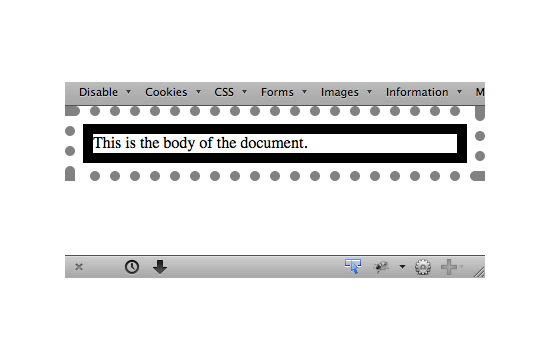

Rysunek. Zmiana stylu elementu głównego.

W dokumentach HTML zawsze da się wybrać element html bezpośrednio, bez używania pseudoklasy `:root`. Te dwa rodzaje
selektorów różnią się jednak specyficznością.

#### Wybieranie pustych elementów (TODO)

<!-- TODO -->

#### Wybieranie unikatowych dzieci

Pseudoklasa `:only-child` wybiera elementy wtedy, gdy są one jedynymi dziećmi innego elementu. Zawsze stosuje się go do
elementu, który ma być jedynym dzieckiem, a nie do elementu rodzica, czyli wybierze element, który nie będzie miał
żadnego rodzeństwa.

Pseudoklasa `:only-of-type` spowoduje wybranie dowolnego elementu, który jest jedynym elementem tego typu spośród całego
rodzeństwa.

```css
p > img:only-of-type {
  float: right;
  margin: 20px;
}
```

Dopóki w danym akapicie nie będzie kilku obrazów będących dziećmi tego samego akapitu, tylko jeden obraz, to obraz ten
otrzyma właściwość float.

#### Wybieranie pierwszego i ostatniego dziecka

Pseudoklasa `:first-child` służy do wybierania elementów, które są pierwszymi dziećmi innych elementów. Rozważmy
następujący kod:

```html
<style>
  p:first-child {
    font-weight: bold;
  }

  li:first-child {
    text-transform: uppercase;
  }
</style>

<div>
  <p>These are the necessary steps:</p>
  <ul>
    <li>Insert key</li>
    <li>Turn key <strong>clockwise</strong></li>
    <li>Push accelerator</li>
  </ul>
  <p>Do <em>not</em> push the brake at the same time as the accelerator.</p>
</div>
```

Pierwsza reguła powoduje pogrubienie dowolnego elementu `p`, który jest pierwszym dzieckiem dowolnego elementu. Druga
reguła powoduje zmianę na duże liter dowolnego elementu `li`, który jest pierwszym dzieckiem innego elementu (co w HTML
oznacza element` `ol`albo`ul`).

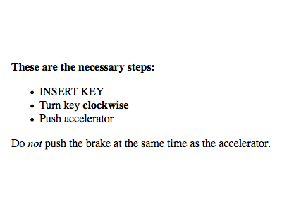

Najczęstszym błędem w tym kontekście jest zakładanie, że selektor w rodzaju `p:first-child` spowoduje wybranie
pierwszego dziecka elementu `p`. Przypominamy, że idea pseudoklas polega na dołączeniu jakiegoś rodzaju klasy fantomowej
do elementu powiązanego z daną pseudoklasą.

Jeśli chcielibyśmy dodać prawdziwe klasy do podanego kodu, wyglądałby on na przykład tak:

```html
<div>
  <p class="first-child">These are the necessary steps:</p>
  <ul>
    <li class="first-child">Insert key</li>
    <li>Turn key <strong class="first-child">clockwise</strong></li>
    <li>Push accelerator</li>
  </ul>
  <p>
    Do <em class="first-child">not</em> push the brake at the same time as the
    accelerator.
  </p>
</div>
```

W rezultacie, jeśli chciałbyś wybrać te elementy em, które są pierwszymi dziećmi innego elementu, powinieneś napisać:
`em:first-child`.

Odwrotnością selektora `:fist-child` jest `:last-child`.

Można połączyć te dwie pseudoklasy, aby uzyskać wariant selektora `:only-child`. Poniższe dwie reguły spowodują wybranie
tych samych elementów:

```css
p:only-child {
  color: white;
}

p:first-child:last-child {
  background-color: red;
}
```

#### Wybieranie pierwszego i ostatniego elementu danego typu

## Kombinatory

Selektor CSS to swoisty rodzaj wskaźnika określający, którym elementom chcemy nadać, lub zmienić właściwości.

### Bezpośrednio zagnieżdżony

Reguła dla elementu (np. paragrafu) będącego potomkiem innego elementu HTML musi zawierać selektor:

```css
.parent p {
  margin: 0;
  padding-top: 30px;
  text-align: center;
  text-shadow: 1px 1px 3px #000;
  font-size: 42px;
  color: #fff;
}
```

Ten selektor wskazuje na element `<p>` zagnieżdżony w elemencie z klasą parent dowolnie „głęboko".

Selektor `.parent > p` wskaże jedynie element `p` będący potomkiem (dzieckiem) elementu `.parent` o "1 poziom” niżej, a
te głębiej zagnieżdżone pominie.

### Jeden po drugim

Aby wskazać "brata” danego elementu, występującego zaraz po innym elemencie, na tym samym poziomie zagnieżdżenia się
użyjemy kombinatora +.

Przykład użycia: `h1 + p` wybierz tylko te elementy `p` będące bezpośrednio za `h1`.

Selektor zadziała pod warunkiem, że w pliku HTML kolejność tagów będzie następująca:

```html
<h1>text</h1>
<p>text</p>
```

Jeśli jednak wkradnie nam się inny element między te wybrane w selektorze, np.:

```html
<h1>text</h1>
<span>text</span>
<!-- nasz intruz -->
<p>text</p>
```

Selektor nie zadziała.

### Elementy na tym samym poziomie

Kombinator `~` w odróżnieniu od `+` pomaga wskazać wszystkie (a nie jeden) bratnie elementy HTML, na tym samym poziomie
zagnieżdżenia.

Jest to dość rzadko używany kombinator. Znajduje zastosowanie tylko w wyjątkowych sytuacjach.

Np. taki selektor `h1 ~ p` wybierze wszystkie elementy `p`, będące na tym samym poziomie zagnieżdżenia co `h1`

## Stan elementu

Dany element HTML może przyjmować pewien stan, dla którego możemy za pomocą odpowiednich pseudo klas, określić jak w
danym stanie ma wyglądać.

Jeśli najedziemy na dany element HTML kursorem, jest on w stanie `:hover`, gdy klikniemy link, jest on w stanie:
`active`, natomiast jeśli postawimy kursor w polu formularza, będzie ono w stanie `:focus`.

### Stan :active

Stan `:active` jest stanem elementu aktywnego. W tym stanie są elementy HTML w momencie kliknięcia, a dokładniej mówiąc
po naciśnięciu przycisku myszki i przed puszczeniem go, będąc kursorem nad danym elementem.

Selektor `:activ`e może zostać dopisany dla każdego elementu, bez różnicy czy będzie to `div`, `p` czy `a`.

Jeśli deklarujemy dla jednego elementu `:hover` oraz `:active` to `:active` musi znajdować się za
`:hover`.

### Stan :focus

Stan `:focus` jest stanem elementów, które reagują na akcje wykonywane poprzez klawiaturę lub inne ich aktywowanie (np.
przez kliknięcie).

Są różne pola, w które możemy np. wpisywać tekst. Takimi elementami zwykle są elementy formularzy (input, textarea itp.)
. Jeśli chcesz wychwycić elementy, posiadające focus kliknij podgląd, użyj klawisza tabulacji i przyglądaj się efektowi.
W momencie, gdy w jednym z takich elementów umieścimy kursor ma on właśnie stan `:focus`.

## Wybór konkretnego elementu

## :nth-child(even)

:nth-child(even) pomoże nam wybrać wszystkie parzyste dzieci danego typu. Ta pseudoklasa często przydaje się do
stylowania list lub tabel.

Jeśli więc przykładowo będziemy chcieli wybrać parzyste elementy p zawarte w elemencie o klasie container to reguła
wyglądałaby następująco:
.container p:nth-child(even){...}

## :nth-child(number)

Selektor :nth-child(number) wybierze konkretne dziecko danego typu, które jest określone przez number.

Przykład:
div p:nth-child(5)
Wybierze piąty paragraf, będący potomkiem div.

Używany na porządku dziennym kiedy chcemy wyróżnić jakiś element strony bez potrzeby dodawania dla niego specjalnej
klasy.

# Kaskada, specyficzność i dziedziczenie

Kaskadowe arkusze stylów CSS (ang. _Cascading Style Sheets_) nie są językiem programowania, ale wymagają myślenia
abstrakcyjnego i trochę kreatywności. Charakteryzują się prostą deklaratywną składnią, która jednakże może przy
większych projektach osiągnąć utrudniającą pracę złożoność.

W CSS zawężenie problemu do postaci pojedynczego pytania nie zawsze jest proste. Nawet, wtedy gdy to się uda, odpowiedź
na pytanie często brzmi: „To zależy”.

TODO

## Kaskada

W CSS dostępnych jest często kilka sposobów osiągnięcia tego samego. Tworzone przez nas reguły powinny być
przewidywalne.

Gdy dwie reguły powodują konflikt informacji dotyczących sposobu użycia stylu dla elementu, to przeglądarka rozwiązuje
go na podstawie zasad, które określamy mianem **kaskady**.

Gdy dwie lub większa liczba reguł dotyczy tego samego elementu na stronie, mogą one powodować wystąpienie deklaracji
wywołujących konflikt.

Zestawy reguł z deklaracjami wywołującymi konflikt mogą występować jeden po drugim albo mogą być rozrzucone w obrębie
arkusza stylów. W każdym wariancie z punktu widzenia użytego kodu HTML wszystkie dotyczą tego samego elementu.

---

**Kaskada** to zestaw reguł, którymi kieruje się przeglądarka przy rozwiązywaniu konfliktów deklaracji podczas nadawania
stylu danemu elementowi. Ponadto stanowi fundamentalną część decydującą o działaniu arkuszy stylów CSS.

---

Choć najbardziej doświadczeni projektanci mają ogólną orientację w kwestii kaskady, jej elementy są czasami źle
rozumiane.

W momencie wystąpienia konfliktu między deklaracjami w celu określenia różnicy między nimi kaskada bierze pod uwagę
następujące trzy kwestie:

1. _Pochodzenie arkusza stylów._ Miejsce, z którego pochodzą style. Użyte style są stosowane w połączeniu ze stylami
   domyślnymi przeglądarki.
2. _Specyficzność selektorów._ Określanie, jakie selektory mają pierwszeństwo względem innych.
3. _Kolejność źródłowa._ Kolejność, w jakiej style są deklarowane w arkuszu stylów.

### Źródło arkusza stylów

Twoje style są nazwane **stylami autora**. Są dostępne o niższym priorytecie **style agenta użytkownika**, które są
domyślnymi stylami przeglądarki. Są jeszcze style użytkownika z pośrednim priorytetem, lecz bardzo rzadko stosowane.

Istnieją trzy źródła arkuszy stylów, które stosuje przeglądarka:

1. Style autora - to style, które nadaje autor strony.
2. Style użytkownika — to style, które definiuje użytkownik przeglądarki.
3. Style agenta użytkownika (ang. _user agent stylesheet_)

#### Style agenta użytkownika

Style agenta użytkownika różnią się nieznacznie w poszczególnych przeglądarkach, ale zasadniczo realizują to samo:
nagłówki (od `<h1>` do `<h6>`), akapity (`<p>`) oraz listy (`<ol>` i `<ul>`) uzyskują górny i dolny margines. Ponadto
listy otrzymują lewe wypełnienie oraz właściwość `list-type-style` o wartości disk w celu utworzenia punktorów.
Natomiast odnośniki stają się niebieskie i są podkreślone.

Po uwzględnieniu stylów agenta użytkownika przeglądarka stosuje Twoje style, czyli style autora. Umożliwia to
deklaracjom określonym przez Ciebie przesłonięcie tych ustawionych przez arkusz stylów agenta użytkownika. Jeśli w
kodzie HTML dodasz odnośnik do kilku arkuszy stylów, wszystkie one będą mieć to samo źródło, czyli autora.

### Ważne deklaracje

Deklaracja może zostać oznaczona jako ważna przez dodanie na jej końcu, ale przed średnikiem, adnotacji `!important`:

```css
p {
  color: red !important;
}
```

Deklaracje oznaczone adnotacją `!important` są traktowane jako źródło o wyższym priorytecie, dlatego ogólna kolejność
preferencji źródeł w porządku malejącym jest następująca:

1. Ważny autor.
2. Autor
3. Agent użytkownika

Kaskada niezależnie rozwiązuje konflikty dla każdej właściwości każdego elementu strony. Jeśli na przykład dla akapitu
ustawisz pogrubioną czcionkę, w dalszym ciągu będą obowiązywać marginesy górny i dolny z arkusza stylów agenta
użytkownika (chyba że jawnie dokonasz ich przesłonięcia).

### Specyficzność

Jeśli nie jest możliwe rozwiązanie konfliktu między deklaracjami na podstawie ich źródła, następnym krokiem podejmowanym
przez przeglądarkę jest zapewnienie rozstrzygnięcia przez sprawdzenie **specyficzności** deklaracji.

Przeglądarka określa specyficzność w ramach dwóch części: w stylach stosowanych liniowo w kodzie HTML oraz w stylach
używanych za pomocą selektora.

#### Style liniowe

Deklaracje zastosowane w atrybucie `style` elementu HTML przesłaniają wszystkie deklaracje z zastosowanego arkusza
stylów lub ze znacznika `<style>`.

Aby temu zapobiec, należy w arkuszu stylów dodać do deklaracji adnotację `!important`, wtedy staje się źródłem o wyższym
priorytecie. Jeśli deklarację w stylach liniowych oznaczymy jako ważną, to żadna deklaracja nie jest w stanie ją
przesłonić.

#### Specyficzność selektora

Różne typy selektorów mają odmienne specyficzności. Selektor identyfikatora ma specyficzność większą niż na przykład
selektor klasy. Okazuje się, że pojedynczy identyfikator ma większą specyficzność niż selektor z dowolną liczbą klas.
Podobnie specyficzność selektora klasy jest większa niż selektora znacznika (nazywanego również **selektorem typu**).

Dokładne reguły specyficzności są następujące:

- Jeśli selektor ma więcej identyfikatorów, zwycięża, czyli jest bardziej specyficzny.
- W razie remisu wygrywa selektor z największą liczbą klas.
- W razie remisu wygrywa selektor z największą liczbą nazw znaczników.

Selektory utworzone za pomocą identyfikatorów posiadają specyficzność, którą trudno przesłonić, chyba że za pomocą
innych identyfikatorów.

#### Notacja związana ze specyficznością.

Specyficzność wskazujemy, posługując się postacią liczbową, w której po każdej liczbie wstawiamy przecinek. Np.
zapis `1, 2, 2` oznacza specyficzność selektora, który składa się z identyfikatora, dwóch klas i dwóch znaczników.
Selektor `#page-title #page-header` ma specyficzność `2, 0, 0` (dwa identyfikatory, zero klas, zero znaczników).
Natomiast selector `ul li` ma specyficzność `0, 0, 2` (zero identyfikatorów, zero klas, dwa znaczniki).

Porównując liczby, określimy, który selektor jest bardziej specyficzny. Specyficzność `1, 0, 0` ma pierwszeństwo
względem specyficzności `0, 2, 2`, a nawet w stosunku do specyficzności ` 0, 10, 0` (nie sensu jednak tworzenie tak
długich selektorów), gdyż pierwsza liczba (identyfikatory) ma wyższy priorytet.

Używana jest także notacja złożona z czterech liczb, gdzie pierwsza liczba oznacza to, czy deklaracja jest stosowana za
pośrednictwem stylów liniowych. W tym wypadku styl liniowy ma specyficzność `1, 0, 0, 0`. Spowodowałoby to przesłonięcie
zastosowanych stylów za pomocą selektorów, które mogłyby zostać wskazane jako mające specyficzność `0, 1, 2, 0` (jeden
identyfikator i dwie klasy) lub coś podobnego.

#### Kwestie związane ze specyficznością

Najszybszym sposobem na wymuszenie jakiegość stylu jest dodanie adnotacji `!important` do deklaracji. Owa adnotacja
ustanawia dla deklaracji źródło o wyższym priorytecie. Jednakże nie jest to najlepszy pomysł, który może później
sprawiać problemy. Jeżeli użyjesz tej adnotacji dla kilku deklaracji, będzie mieć miejsce zgodność źródeł, dlatego
obowiązywać będą zwykłe reguły specyficzności. Ostatecznie zakończy się to powrotem do punktu wyjścia. Gdy już
rozpoczniesz korzystać z adnotacji `!important`, prawdopodobnie będziesz sięgać po nią coraz częściej.

Lepszym sposobem jest zwiększenie specyficzności selektora, na którym nam zależy lub obniżenie specyficzności selektora,
który nam nie pozwala zastosować nasz styl.

Może się okazać, że specyficzność staje się czymś w rodzaju „wyścigu zbrojeń”. Dotyczy to szczególnie dużych projektów.
Przeważnie, jeśli to możliwe, najlepiej utrzymać niską specyficzność. Dzięki temu, gdy pojawi się potrzeba przesłonięcia
czegoś, możliwy będzie wybór.

### Kolejność źródłowa.

Jeśli źródło i specyficzność są takie same, pierwszeństwo ma deklaracja pojawiająca się dalej w arkuszu stylów lub
występująca w arkuszu, który dołączono później w obrębie strony.

Mając do czynienia z problemem dotyczącym stosowania stylów, często zajmuję się nim dwuetapowo. Po pierwsze, stwierdzam,
jakie deklaracje zapewnią właściwy wygląd elementu. Po drugie, zastanawiam się nad możliwymi sposobami określającymi
strukturę selektorów i wybieram ten, który najlepiej spełnia wymagania.

#### Style odnośników i kolejność źródłowa.

Style odnośników na stronie we „właściwej” kolejności:

```css
a:link {
  color: blue;
  text-decoration: none;
}

a:visited {
  color: purple;
}

a:hover {
  text-decoration: underline;
}

a:active {
  color: red;
}
```

Kaskada jest powodem, dla którego ta kolejność jest istotna: w wypadku tej samej specyficzności późniejsze style
przesłaniają te wcześniejsze.

Mnemonikiem ułatwiającym zapamiętanie takiej kolejności są anglojęzyczne słowa tworzące kombinację LoVe/HAte (ang. Link,
Visited, Hover, Active — odnośnik, odwiedzony, umieszczenie nad, aktywowanie).

#### Wartości kaskadowe

Deklaracja, która „zwycięża” kaskadę, nazywana jest wartością kaskadową . Dla każdej właściwości każdego elementu
istnieje co najwyżej jedna wartość kaskadowa.

**Wartość kaskadowa** — wartość określonej właściwości stosowana dla elementu jako wynik kaskady.

# Podstawowe formatowanie wizualne

Ten rozdział opisuje teoretyczne aspekty wizualizacji elementów w CSS.

## Podstawowe pojemniki

CSS zakłada, że każdy element generuje jeden lub więcej prostokątnych obszarów zwanych pojemnikami albo pudełkami
elementu (ang. _element box_).

Wewnętrzna część każdego pojemnika elementu nazywana jest obszarem treści elementu (ang. _content area_). Obszar
zawartości elementu opcjonalnie może być otoczony dopełnieniem, obramowaniem, konturami oraz marginesami. Ich szerokość
może zostać ustawiona na zero, co w praktyce powoduje ich usunięcie z pojemnika elementu.

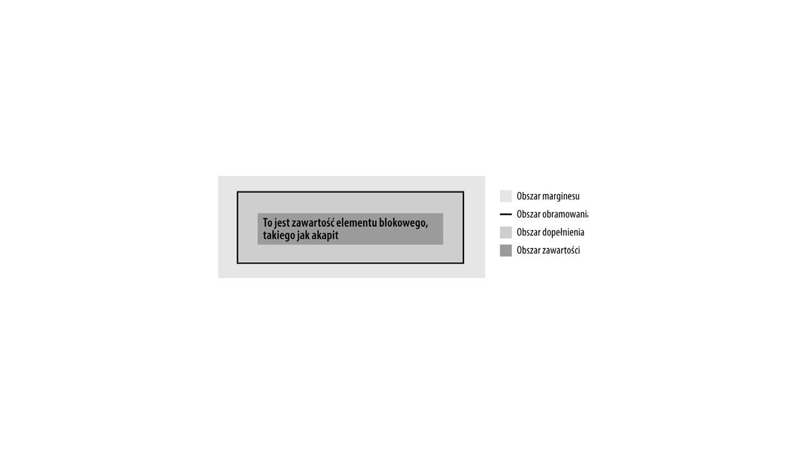

Tło elementu domyślnie rozciąga się także na dopełnienie, podczas gdy marginesy są zawsze przezroczyste i pozwalają na
uwidocznienie tła elementów przodków. Wartości ujemne nie mogą być podane w deklaracji dopełnienia, ale mogą być użyte
przy marginesach.

Styl obramowania można ustawić za pomocą styli typu solid lub dashed, a jego kolor za pomocą właściwości border-color.
Jeśli nie zdefiniuje się koloru obramowania, przyjmowany jest kolor zawartości elementu.

## Krótka powtórka

> _Układ normalny_
>
> Pisany od lewej do prawej i od góry do dołu tekst w językach zachodnich oraz znany układ tekstu tradycyjnych dokumentów
> HTML. Większość elementów znajduje się w układzie normalnym (ang. _normal flow_) i jedynym sposobem znalezienia się
> poza nim jest ustawienie elementu jako pływającego, pozycjonowanego bądź umieszczenie go w układzie typu flexbox lub
> w układzie siatkowym.

> _Element niezastępowany_
>
> Element, którego zawartość znajduje się w dokumencie. Przykładowo, akapit `p` jest elementem niezastępowanym,
> ponieważ jego treść (tekst) znajduje się wewnątrz samego elementu.

> _Element zastępowany_
>
> Element, który spełnia funkcję pojemnika na coś innego. Np. element `img` tylko wskazuje na plik z obrazem.
> Elementy zastępowane to również większość elementów formularza (na przykład `<input type="radio">`).

> _Element główny_
>
> Element znajdujący się na szczycie drzewa dokumentu. W dokumentach HTML jest nim element `html`.

> _Pojemnik elementu blokowego_
>
> Jest tworzony przez element taki jak akapit, nagłówek czy div. W układzie normalnym elementy te generują nowe wiersze
> zarówno przed swoimi pojemnikami, jak i po nich, dlatego układane są na sobie w pionie.
> Dowolny element może stać się blokowym => `display: block'.

> _Pojemnik elementu liniowego_
>
> Jest tworzony przez element taki jak strong czy span. Elementy te nie powodują „złamania wiersza” przed nimi bądź po
> nich.
> Dowolny element może stać się blokowym => `display: inline'.

> _Pojemnik liniowo-blokowy_
>
> Jest to pojemnik, który wewnętrznie zachowuje się jak pojemnik blokowy, ale na zewnątrz jak pojemnik liniowy.
> Jego działanie jest podobne (ale nieidentyczne) jak elementu zastępowanego. Wyobraź sobie element `div`, który został
> umieszczony w wierszu tekstu tak, jakby był to obraz.

### Blok zawierający element (ang. _containing block_).

Umiejscowienie każdego pojemnika elementu uzależnione jest od bloku zawierającego; w istocie blok zawierający stanowi
„kontekst układu” dla pojemnika.

Dla elementu blok zawierający jest tworzony przez krawędzie obszaru zawartości najbliższego elementu przodka, który
wygenerował pozycję listy albo pojemnik blokowy.

## Zmiana sposobu wyświetlania elementu

Sposób wyświetlania elementu przez przeglądarki można zmienić poprzez ustawienie odpowiedniej wartości właściwości
`display`.

### display

**display**:

Wartości: [ \<display-outside\> ‖ \<display-inside\> ] | \<display-listitem\> | \<display-internal\> | <display-box> |
\<display-legacy\>

Definicje: Zobacz niżej

Wartość początkowa: inline

Stosuje się do: Wszystkich elementów

Wartość wyliczona: Jak określono

Dziedziczona: Nie

Animowana: Nie

\<display-outside\>

block | inline | run-in

\<display-inside\>

flow | flow-root | table | flex | grid | ruby

\<display-listitem\>

list-item && <display-outside>? && [ flow | flow-root ]?

\<display-internal\>

table-row-group | table-header-group | table-footer-group | table-row | table-cell |

table-column-group | table-column | table-caption | ruby-base | ruby-text |

ruby-base-container | ruby-text-container

\<display-box\>

contents | none

\<display-legacy\>

inline-block | inline-list-item | inline-table | inline-flex | inline-grid

### Zmiana ról

Każdy element liniowy możemy wyświetlić jako blokowy i vice versa. Oznacza to jedynie zmianę sposobu wyświetlania
elementów, a nie ich prawdziwej natury. Innymi słowy, zmuszenie akapitu do wygenerowania liniowego pojemnika
wewnętrznego nie sprawi, że akapit ten stanie się elementem liniowym. W HTML na przykład niektóre elementy są blokowe,
podczas gdy inne są elementami liniowymi. Element liniowy może być potomkiem elementu blokowego, ale nie odwrotnie. To
znaczy, że choć element span można umieścić w akapicie, to nie da się ująć akapitu w ramy elementu span. Będzie tak bez
względu na to, w jaki sposób wystylizowane zostaną te elementy.

### Elementy blokowe

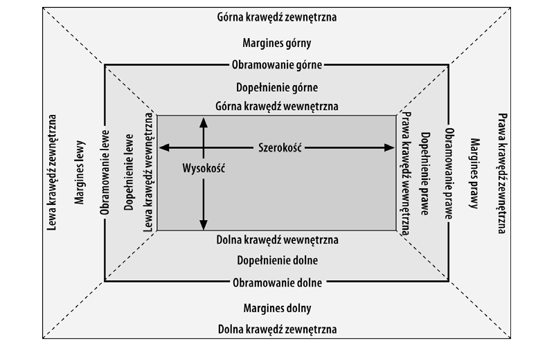

Szerokość pojemnika blokowego (`width`) definiowana jest jako odległość mierzona od lewej krawędzi wewnętrznej do prawej
krawędzi wewnętrznej, a wysokość tego pojemnika (`height`) — jako odległość pomiędzy górną a dolną krawędzią wewnętrzną.

Sposób interpretowania tych właściwości da się zmienić za pomocą właściwości `box-sizing`.

<hr>

**box-sizing**:

Wartości: content-box | padding-box | border-box

Wartość początkowa: content-box

Stosuje się do: Wszystkich elementów, które obsługują wartości width albo height.

Wartość wyliczona: Jak określono.

Dziedziczona: Nie

Animowana: Nie

<hr>

Ta właściwość umożliwia zmianę sposobu działania wartości parametrów `width` i `height`.

Jeśli zadeklarujesz `width`: 400px, ale nie określisz wartości właściwości `box-sizing`, to pojemnik zawartości elementu
będzie miał szerokość 400 pikseli, a wszelkie dopełnienia, obramowania i tak dalej zostaną dodane do tej szerokości.

Jeśli z kolei zadeklarujesz `box-sizing: border-box`, to pojemnik elementu będzie miał 400 pikseli od lewej zewnętrznej
krawędzi obramowania do prawej zewnętrznej krawędzi obramowania, a wszelkie obramowania i dopełnienia będą mieściły się
w tej przestrzeni, zmniejszając obszar zawartości.

Dotyczy to elementów generujących pojemniki blokowe, ale także zastępowanych elementów liniowych, takich jak obrazy, a
także pojemników elementów liniowo-blokowych.

Różne szerokości, wysokości, dopełnienia i marginesy razem wyznaczają układ graficzny dokumentu. W większości przypadków
przeglądarka automatycznie dobiera wysokość i szerokość dokumentu (na podstawie dostępnego obszaru wyświetlania).

Dzięki CSS można jednak przejąć bezpośrednią kontrolę nad tym, w jaki sposób elementy są wyświetlane i jakie mają
wymiary.

### Formatowanie poziome

### Właściwości poziome

Siedem właściwości formatowania poziomego to: margin-left, border-left, padding-left, width, padding-right, border-right
oraz margin-right. Właściwości te, których diagram przedstawiony został na rysunku, odnoszą się do układu pojemników
blokowych w poziomie.

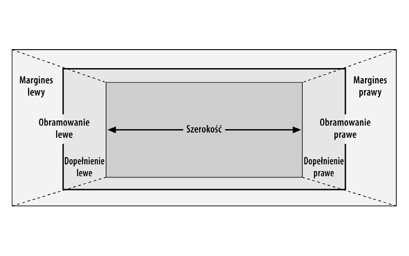

Suma wartości tych siedmiu właściwości musi być równa szerokości bloku zawierającego, która odpowiada wartości `width`
elementu rodzica tego bloku.

Tylko szerokość obszaru elementu oraz lewy i prawy margines mogą mieć ustawioną wartość auto. Reszta właściwości musi
mieć podaną wartość lub domyślną zero.

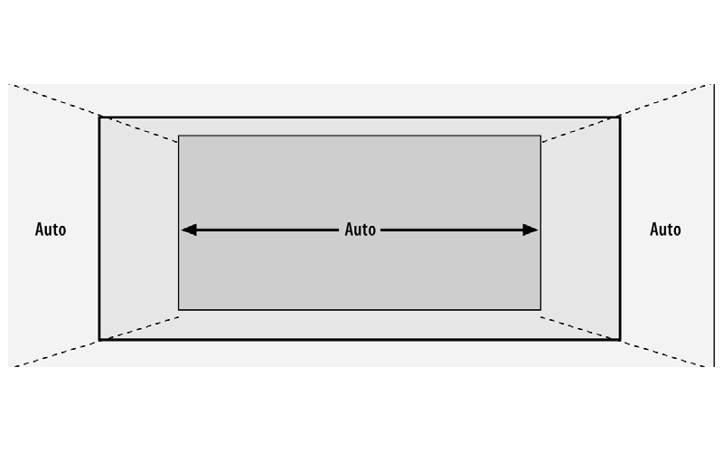

### Wykorzystywanie wartości auto

# Pozycjonowanie

# Przejścia

Przejścia CSS umożliwiają animowanie właściwości CSS — czyli płynną zmianę od wartości początkowej do nowej wartości
docelowej z upływem czasu. Powodują one zmianę jednego stanu elementu na drugi w reakcji na jakąś zmianę — zwykle
wynikającą z działania użytkownika, ale także z zaprogramowanych w skrypcie zmian klas, identyfikatorów albo innego
rodzaju stanów.

Każda zmiana wartości właściwości CSS zachodzi natychmiastowo. Na przykład zmiana koloru tła po wskazaniu danego
elementu kursorem myszy jest bezzwłoczna, bez płynnego przejścia między barwami.

Przejścia (ang. _transitions_) CSS umożliwiają sterowanie sposobem zmiany jednej wartości właściwości na inną w ciągu
określonego czasu. Dzięki temu możemy uzyskać płynną zmianę wartości.

```css
button {
  color: magenta;
  transition: color 200ms ease-in 50ms;
}

button:hover {
  color: rebeccapurple;
  transition: color 200ms ease-out 50ms;
}
```

Zmiana koloru, bez względu na to ile trwa, jest pewną formą przejścia. Jednak dzięki właściwości `transition` zmiana
koloru następuje stopniowo, w ciągu pewnego czasu, a jej płynność jest łatwo dostrzegalna dla oka.

Z punktu widzenia wygody użytkownika natychmiastowa zmiana wartości często jest najlepsza.

Czasami może nam zależeć na tym, by zmiana wartości właściwości następowała bardziej stopniowo i zwracała uwagę na to,
co się dzieje. Możemy na przykład nadać grze w karty pozory większego realizmu, wprowadzając animację odwracania karty
trwającą 200 milisekund, bo w przypadku braku animacji użytkownik może nawet nie zauważyć, co się zmieniło.

Dzięki przejściom rozwijane menu mogą się wyświetlać powoli. Jest to jedno z typowych zastosowań przejść CSS.

## Właściwości przejść

Przejścia tworzy się za pomocą czterech właściwości przejść:

- `transition-property`,
- `transition-duration`,
- `transition-timing-function`
- `transition-delay`;

Istnieje też skrótowa właściwość `transition` obejmująca te cztery właściwości składowe.

# Notatki z kursu front-end html-css fc

# Czym jest flex, grid?

Przez wiele lat programiści stron internetowych mieli bardzo dużą trudność w pozycjonowaniu elementów. Wiele takich sytuacji wymagało stosowania tzw. "hacków" czyli obchodzenia typowego zastosowania pewnych rozwiązań w celu uzyskania zamierzonego efektu. To były tricki, a nie w pełni stabilne, natywne rozwiązania.
Dużo zmieniło się od czasu wejścia CSS w wersji trzeciej. To on przyniósł długo wyczekiwane rozwiązania mające ułatwić naszą pracę.
_Flex_ oraz _grid_ to sposoby na układanie elementów np zgodnie z designem, który został nam dostarczony.

# Co lepsze? Grid czy Flex?

Nie można odpowiedzieć na to pytanie, bo oba rozwiązania mają swoje wady i zalety, są stosowane w zaleźności od potrzeb.
Zaletą _Grida_ jest stworzenie sztywnych ram naszego layoutu (czyli wyglądu strony, planu) i automatyczne dopasowywanie ich, w zależności od ilości treści.
_Flex_ jest bardzo elastyczną metodą i pozwala nam na nieco więcej "kombinowania", ale używany nierozważnie może doprowadzić do błędnego wyświetlania zawartości strony.

# Flex - wprowadzenie

Pamiętacie parametr CSS display? To w nim będziemy decydować czy element ma być elementem flexowy bądź gridowym.

```css
.box-container {
  display: flex;
}
```

Co nam to na początku daje? To, że divy wewnątrz będą układały się obok siebie. Są dziećmi naszego `box-container` więc z założenia chcemy je jakoś uporządkować.
Powiedzmy, że w `box-container` chcemy żeby znalazły się 3 boxy.

- Sam container ma mieć 200px wysokości i 100% szerokości. Ma żółte tło.
- Boxy to divy o rozmiarze 100x100 pixeli, mają niebieskie tło.
- Chcemy żeby te 3 boxy ułożyły się w równych odległościach od siebie, wykorzystując całą dostępną szerokość box-containera
- Chcemy żeby w pionie zostały wyśrodkowane względem box-containera

Warto wyróżnić kilka najczęściej używanych parametrów flexowych:

- justify-content - decyduje o tym jak nasze elementy będą się układać w poziomie
- align-items - decyduje o tym jak nasze elementy będą się układać w pionie
- flex-wrap - decyduje o tym czy nasze elementy mają się załamywać do nowej linii kiedy będzie ich "za dużo"

Nasz plik wyglądałyby wtedy w następujący sposób:

```css
<div
  class='box-container'
  > <div
  class='box'
  > </div
  > <div
  class='box'
  > </div
  > <div
  class='box'
  > </div
  > </div
  > .box-container {
  display: flex;
  justify-content: space-between;
  align-items: center;
  height: 200px;
  background: yellow;
}

.box {
  width: 100px;
  height: 100px;
  background: blue;
}
```

Jeżeli chcielibyśmy aby elementy miały dookoła siebie równe przerwy (żeby skrajne z lewa i prawa nie były przyklejone zaraz do krawędzi kontenera)
Wystarczyłoby zmienić jeden parametr:

```css
justify-content: space-evenly;
```

Flex daje nam też możliwość ustalenia kolejności układania elementów. Na przykład zamiast domyślnie układać się w wierszu (horyzontalnie), możemy kazać elementom układać się jeden pod drugim:

```css
.box-container {
  flex-direction: column;
}
```

Jeżeli chcielibyśmy zastosować jakieś indywidualne zasady pozycjonowania dla pojedynczego elementu, to skorzystamy z kolei z

`align-self`.

Nasze boxy były wyśrodkowane ale gdybyśmy chcieli żeby jeden był przyklejony do dołu kontenera, to możemy przypisać mu klasę modyfikatora, w której zastosujemy wspomniany parametr:

```css
.box__bottom {
  align-self: flex-end;
}
```

Jest bardzo dużo zastosowań flexa i tak naprawdę ogranicza nas tylko nasza wyobraźnia. Polecamy zapoznać się z kompletnym tutorialem popularnej strony [CSS-Tricks](https://css-tricks.com/snippets/css/a-guide-to-flexbox/), w którym możecie zobaczyć wszystkie dostępne parametry flexowe wraz z wizualizacją ich działania!
CSS-Tricks

## Zadanie domowe - zrób, nim przejdziesz dalej!

Wyobraźmy sobie najpopularniejszy typ nawigacji na stronie. Co widzimy? Pewnie w większości logo po lewej stronie i linki do odpowiednich sekcji po prawej stronie. Może jest to już nieco zbyt oczywiste, ale równiez bardzo intuicyjne dla wielu użytkowników. Twoim zadaniem będzie więc zrobienie:

Nawigacji, o szarym tle, która zajmuje całą szerokość przeglądarki, ma padding z każdej strony na 2%, a w środku znajdą się 2 elementy: logo jako  (wybierz dowolne) o szerokości 50px; oraz pozioma lista z linkami (max 4).

Logo powinno być przyklejone do lewej strony, a linki powinny wyświetlać się po prawej. Wysokość nawigacji dostosuje się automatycznie do treści.

Upewnij się, że logo i nasze linki znajdują się na środku pionie.
Nie używaj float, tylko stosuj techniki flex.

# Rozszerzenie: Flex i Grid w CSS

## Grid - wprowadzenie

Czym w ogóle jest grid? Czy to tylko zagadnienie CSS'owe, czy stoi za tym coś więcej? Grid istniał w webdesignie na wiele lat przed wprowadzeniem tej funkcji w CSS.
Samo pojęcie grida sprowadza się do podzielenia projektu strony/aplikacji na kolumny i wiersze. Zwykle jest to 12 kolumn, rzadziej 8, 6.

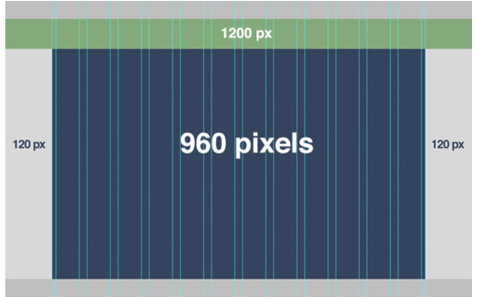

Po co się to robi? Ma to związek z zagadnieniem RWD (Responsive Web Design), o którym powiemy na następnych lekcjach. W dużym skrócie - łatwiej stworzyć responsywną, elastyczną stronę trzymając się proporcji zamiast stałych wartości.
Na przykład jakiś element ma zająć 4 z 12 dostępnych kolumn na szerokość - czyli jedną trzecią. Podając to w pixelach bylibyśmy ograniczeni do konkretnych wyświetlaczy, a programista mógłby się nie domyślić tego co w planach miał designer.

## Podstawowe parametry Gridowe

Analogicznie do zastosowania flex'a, oczywiście w tym przypadku też musimy zacząć od ustawienia odpowiedniej wartości parametrowi display.

```css
.box-container {
  display: grid;
}
```

W naszym przykładzie spróbujemy zrobić prostą siatkę `9x9`.
Będziemy chcieli wyświtlić 9 identycznych, niebieskich, kwadratowych boxów - po 3 w jednym rzędzie. Taki schemat moglibysmy wykorzystać na przykład w grze kółko-krzyżyk albo memory.

Aby dało się je od siebie rozróżnić, ustawimy między nimi przestrzeń - tzw. _gap_ o rozmiarze 1%.

```html
<div class="box-container">
  <div class="box"></div>
  <div class="box"></div>
  <div class="box"></div>
  <div class="box"></div>
  <div class="box"></div>
  <div class="box"></div>
  <div class="box"></div>
  <div class="box"></div>
  <div class="box"></div>
</div>
```

```css
.box-container {
  display: grid;
  width: 500px;
  height: 500px;
  grid-template-columns: 33% 33% 33%;
  grid-template-rows: 33% 33% 33%;
  grid-gap: 1%;
}

.box {
  background: blue;
}
```

Przeanalizujmy podany kod.

```css
.box-container {
  grid-template-columns: 33% 33% 33%;
  grid-template-rows: 33% 33% 33%;
  grid-gap: 1%;
}
```

Te parametry sprawiają, że:

ustalamy szerokości kolumn - 3 kolumny po 33%, bo chcemy żeby każdy zajął 1/3 szerokości całego kontenera, który w naszym przykładzie ma 500x500 pixeli;
ustalamy wysokość wierszy - 3 wiersze po 33%, bo chcemy żeby każdy zajął 1/3 wysokości całego kontenera
ustalamy przerwę między tymi elementami - aby poszczególne "kafelki" były od siebie rozróżnialne, a nie zlały się w całość
Inaczej niż zazwyczaj, tutaj ta przestrzeń pomiędzy elementami dzieje się automatycznie. Chociaż mamy wykorzystane 99% na same kafelki (3 x 33%) to zmieściliśmy 2%.

Może chcielibyśmy stworzyć sekcje z bocznymi menu dla każdej z nich?

```css
.box-container {
  grid-template-columns: 20% auto 20%;
  grid-template-rows: auto;
  grid-gap: 1%;
}
```

W tym przypadku mówimy CSS'owi, że pierwsza i ostatnia kolumna mają mieć po 20%, a środkowa ma wykorzystać automatycznie pozostałe miejsce. Tym razem uznaliśmy też, że nasza sekcja może mieć sporo treści i ustalanie jej wysokości na sztywno to zły pomysł, dlatego w grid-template-rows podaliśmy wartość auto. To znaczy, że wiersze dostosują swoją wysokość automatycznie, uwzględniając ich zawartość.

Efekt?

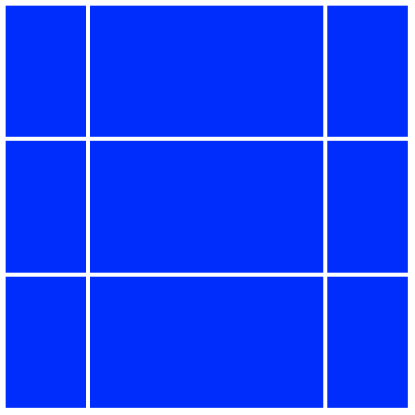

Przejdźmy jednak do największego "bajeru". Czyli definiowania tego grida w sposób bardzo intuicyjny i obrazowy - ale też przydatny do bardziej życiowych sytuacji.
Powiedzmy, że nasza strona ma mieć następującą "siatkę" - czyli grid layout. Zdecydowaliśmy, że kolumn będzie 6:

Nawigacja ma mieć 100% szerokości
Poniżej ma się znaleźć boczne menu na 2/6 szerokości
Reszta tego wiersza to artykuły
Poniżej chcemy wyświtlić 2 reklamy naszych produktów, oba po 50% szerokości
Na samym dole mamy stopkę na 100% szerokości strony

Oto jak to zapiszemy:

```html
<div class="container">
  <div class="nav">nav</div>
  <div class="side-nav">side-nav</div>
  <div class="content">content</div>
  <div class="ad1">ad1</div>
  <div class="ad2">ad2</div>
  <div class="footer">footer</div>
</div>
```

```css
.nav {
  grid-area: nav;
}
.side-nav {
  grid-area: side-nav;
}
.content {
  grid-area: content;
}
.ad1 {
  grid-area: ad1;
}
.ad2 {
  grid-area: ad2;
}
.footer {
  grid-area: footer;
}

.container {
  display: grid;
  grid-template-columns: auto;
  grid-template-rows: auto;
  grid-template-areas:
    'nav nav nav nav nav nav'
    'side-nav side-nav content content content content'
    'ad1 ad1 ad1 ad2 ad2 ad2'
    'footer footer footer footer footer footer';
  text-align: center;
  grid-gap: 10px;
}

.container div {
  background: blue;
  padding: 10px;
}
```

Efekt?

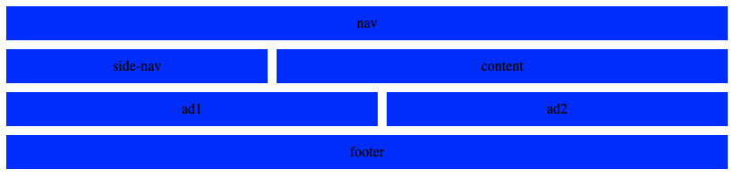

Ok, ale co tu się dzieje?

Przede wszystkim, na początku zrobiliśmy sobie `container` w naszym pliku HTML.
Wrzuciliśmy do niego divy odpowiadające sekcjom, które chcielibyśmy wyświetlić.
W CSS zdefiniowaliśmy klasy tych elementów, jedyne co w nich dodajemy do parametr `grid-area`, którego zadaniem jest przypisanie nazwy tej części naszego grida.
Opisaliśmy klasę `containera`. Ustawiamy oczywiście `display` na `grid` i pozwalamy kolumnom oraz wierszom dostosowywać swój rozmiar odpowiednio do zawartości - `auto`.
Tutaj zaczynają się czary :) W `grid-template-areas` możemy użyć zdefiniowanych przez nasz wcześniej grid-area. Wpisujemy je w jednym wierszu tyle razy ile chcemy żeby proporcjonalnie zajęły miejsca. Musimy pamiętać, że każdy wiersz musi mieć tyle samo kolumn! Czyli jeżeli nav ma zająć całą szerokość, a mamy 6 kolumn, to trzeba go wpisać 6 razy.
Sprawiliśmy dla czytelności, że tekst się wyśrodkowuje.
Dodaliśmy wszystkim div'om wewnątrz containera niebieskie tło oraz `padding` - w celach estetycznych i żeby się łatwiej wyróżniały dla przykładu.

## Podsumowanie

_Flex i Grid_ to potężne narzędzia, które dają nam olbrzymie możliwości i przyspieszają zdecydowanie pracę nad stronami i aplikacjami.

Pamiętajcie jednak o najważniejszej zasadzie - nim przejdziecie dalej, spróbujcie napisać swoje małe strony przy ich użyciu. Nie kopiując i wklejając wartości, tylko robiąc to samemu :)

Podobnie jak na końcu poprzedniego wpisu, gorąco zachęcamy do "wgryzienia" się bardziej w temat przy pomocy tutoriala grupy CSS-Tricks, którzy przedstawiają wszystkie dostępne parametry gridu oraz wizualizują ich zachowanie.

[](https://css-tricks.com/snippets/css/complete-guide-grid/)

## Zadanie domowe - zrób, nim przejdziesz dalej!

Warto byłoby przećwiczyć tego Grida i zrozumieć na własnej skórze jak działa, dlatego Twoimi zadaniami będzie:

Zrób siatkę, która będzie składać się z 4 wierszy po 6 kolumn (4x6)
Niech każdy element ma szare tło oraz jest oddzielony od pozostałych o 15px.

Stwórz grid, w którym:
obszar (area) header zajmie całą szerokość i 1/3 wysokości,
obszar sidebar zajmie 50% szerokości i pozostałe 2/3 wysokości, po lewej stronie,
po prawej stronie obszar main oraz footer zajmą pozostałe 50% szerokości i oba po 1/3 wysokości, jeden pod drugim.
Tekstowa interpretacja zadania drugiego:

```text
"header  header"
"sidebar main  "
"sidebar footer";
```
